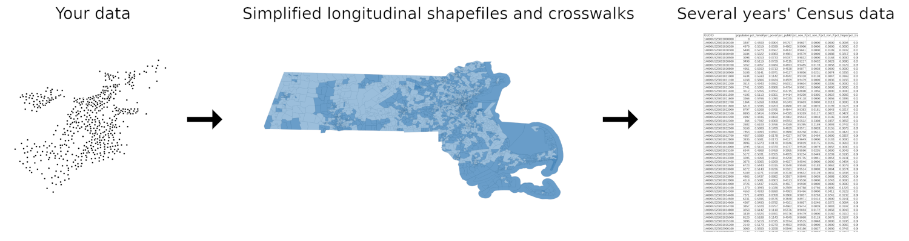

# census-ses-covariates

Scripts to aid in generating and spatially joining longitudinal Census data



### Quick start

1. Run `measures.R` to generate longitudinal covariate tables.
2. Run `crosswalk.R` to generate simplified longitudinal shapefiles and corresponding crosswalks.
3. Spatially join your data to the longitudinal shapefiles. Joins may return more results than expected because the shapefiles encompass several years of revisions (see `crosswalk.R`).
4. Join the crosswalk tables on `GEOID` and `amended`.
5. Join the longitudinal covariate tables on `GEOID` and `year`.

See the `Setup` section of `validation.R` for a quick example. Note that nearest-neighbor joining is currently not supported.

### measures.R

This script uses the [totalcensus](https://github.com/GL-Li/totalcensus) package to extract selected Census summary table variables and generate additional metrics, such as inequality indices, for all available ACS 5-year estimate releases across all 50 states and the District of Columbia for multiple different geographic levels. These data are additionally combined into a longitudinal data sets in both long and wide format at both state and national levels.

All currency-based measures are available as inflation-adjusted both to the year of the estimate and to 2019. 2019 inflation-adjustments were made using the [U.S. Bureau of Labor Statistics CPI Inflation Calculator](https://www.bls.gov/data/inflation_calculator.htm).

Included indices:

* Gini index (Gini, 1912)
    * Directly from the Census; only at the tract level
* Ethnic fractionalization of black, white, asian, and hispanic populations (Alesina, Devleeschauwer, Easterly, Kurlat, & Wacziarg, 2003)
* Index of Concentration at the Extremes for income and race/ethnicity (Krieger, Kim, Feldman, & Waterman, 2018)
    * Cutoffs for percentiles were chosen based on inflation-adjusted 2019 dollars; see [B19001_cutoffs.xlsx](inputs/B19001_cutoffs.xlsx)

About 600 GB of space is required to run this script. The use of `totalcensus` rather than `tidycensus` was motivated by a desire to both relieve stress on the Census servers and allow for quick iterative updates. Support for `tidycensus` may be added in the future.

### crosswalk.R

Aside from the major nationwide changes to TIGER/Line geographies made every 10 years to coinciding with each decennial Census, some minor changes are made in the intermittent years, for example:

* [In 2011](https://www.census.gov/programs-surveys/acs/technical-documentation/table-and-geography-changes/2011/geography-changes.html), 12 tracts in New York were renamed, 3 were changed and 1 was removed as a result of merging.
* [In 2012](https://www.census.gov/programs-surveys/acs/technical-documentation/table-and-geography-changes/2012/geography-changes.html), 7 tracts in Arizona were renamed.
* Also in 2012, 1 tract in California was removed and 1 tract was reinstated.

In addition to these changes, several more boundary changes have been made throughout the years, both documented and undocumented. The undocumented changes appear to be particularly prevalent in areas where the boundaries coincide with bodies of water.

To abstract away these issues, this script generates simplified shapefiles and accompanying crosswalks that can be used to spatially join the long-format longitudinal covariate tables generated by `measures.R` in a quick and efficient manner.

The simplified shapefiles combine all revisions to the selected Census geographies into one shapefile per state and only keeps the reference year (2009) and subsequent amendments, to save on space and computing power. For example, if a tract changed 3 times between 2009 and 2019, then 3 copies of it would exist overlapping in the longitudinal shapefile. The crosswalk tables allow these few revisions to be joined to the full range of years for which measures have been generated.

About 14 GB of space is required to run this script. This is because the script must first build a local copy of the TIGER/Line shapefiles.

### validation.R

This script contains some small tests for validating the generated tables and shapefiles against external sources. This script assumes that `measures.R` and `crosswalk.R` have been run already. Implemented tests:

### formula.R

This is an in-development module that implements a formula interface for generating covariates, so that covariate calculations can be expressed as a simple algebra of Census variable names:

```r
c(
  race_total ~ B03002_001,
  pct_age_21 ~ (B01001_009 + B01001_033) / B01001_001,
  ethnic_fractionalization ~ 1 - (
    (B03002_003 / B01001_001)^2 + (B03002_004 / B01001_001)^2 +
    (B03002_006 / B01001_001)^2 + (B03002_012 / B01001_001)
  )
)
```

A second goal of this module is to decouple the scripts from the `totalcensus` package (e.g. in case `tidycensus` might be preferred), allowing the Census query backend to be swapped out.

### References

1. Alesina, A., Devleeschauwer, A., Easterly, W., Kurlat, S., & Wacziarg, R. (2003). Fractionalization. Journal of Economic Growth, 8(2), 155–194. https://doi.org/10.1023/A:1024471506938
2. Gini, Corrado (1912). Variabilità e mutabilità. Reprinted in Pizetti, E.; Salvemini, T., eds. (1955). Memorie di metodologica statistica. Rome: Libreria Eredi Virgilio Veschi.
3. Krieger, N., Kim, R., Feldman, J., & Waterman, P. D. (2018). Using the Index of Concentration at the Extremes at multiple geographical levels to monitor health inequities in an era of growing spatial social polarization: Massachusetts, USA (2010–14). International Journal of Epidemiology, 47(3), 788–819. https://doi.org/10.1093/ije/dyy004
